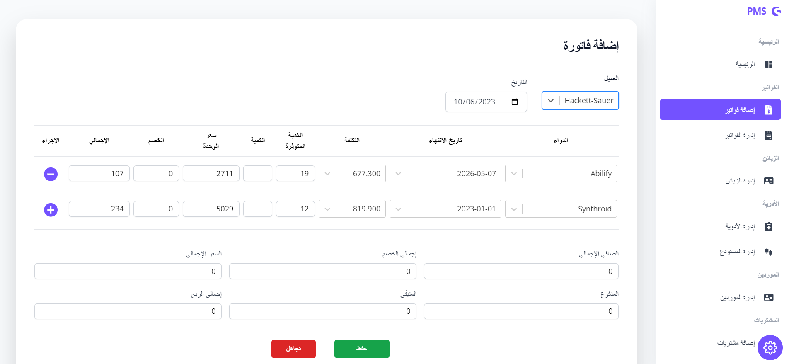

## Pharmacy Managment System

This is a web application built to make jobs and proccesses inside pharmacies much easier. it's allow users to manage and track all information about Drugs, Inventory, Invoices, Purchases, Vouchers, Employees along side helpful Charts and Reports.

## Functionality

-   Allow users to create accounts and manage their own Pharmacies.
-   Shows the Information about Drugs, Inventory, Customer, Invoices, Purchases, Suppliers, Voucher and allow to create or update this information.
-   Simplified the process of invoice creation by automating the steps involved, resulting in increased efficiency.
-   Manage and track the information of Drugs (Out Of The Stocks , Expired).
-   Ability to add Employees to Pharmacy and manage their permissions and roles.
-   Provides the searching facilities based on various factors. Such as Drugs, Inventory, Pharmacy, Sells.
-   Provide Reports for all kind of information.

## Installation

#### Laravel

```shell
   # Install dependencies
   composer install

   # Create .env file with your configurations
   cp .env.example .env

   # Generate new key
   php artisan key:generate

   # Upload database
   php artisan migrate

   # Run server
   php artisan serve

```

#### React

```shell
   # Enter Vue directory
   cd react

   # Install npm dependencies
   npm install

   # Create .env file with your configurations
   # Set your backend api URL
   cp .env.example .env

   # Run vite server
   npm run dev
```

## Screen Shots

<p align="center">




</p>
